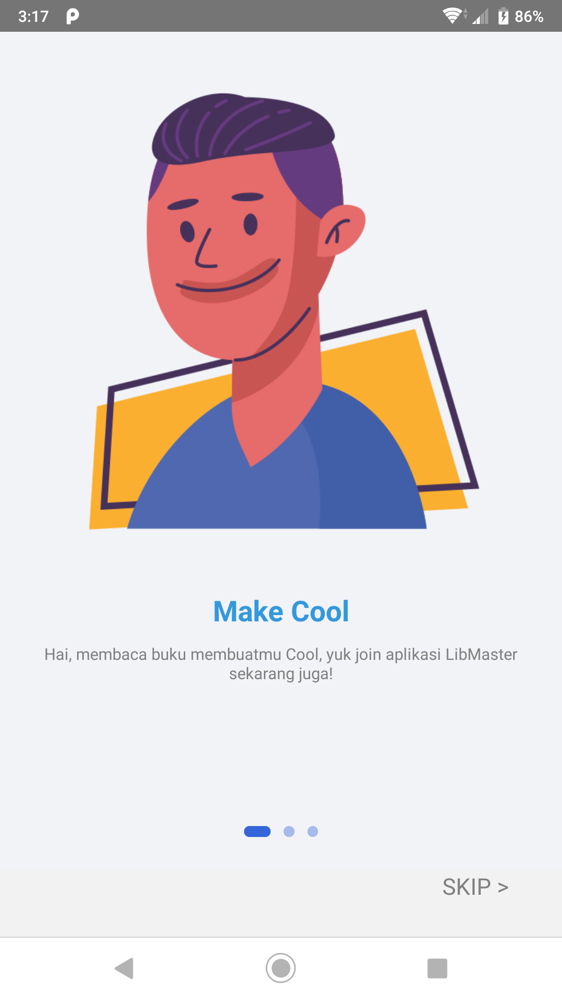

<h1 align="center">Libmaster</h1>

  

  - by Zulfian -

## Table of Contents

- [Introduction](#introduction)
- [Features](#features)
- [Requirements](#requirements)
- [Usage](#usage-for-development)
- [Screenshots](#screenshots)
- [Related Project](#related-project-backend)
- [Release APK](#release-apk)

## Introduction

<b>Libmaster</b> is a mobile application where we can borrow and return books

## Features

- List book
- Borrow the book
- History borrow
- Return book
- Searching book

## Requirements

- [`npm`](https://www.npmjs.com/get-npm) or [`yarn`](https://yarnpkg.com/getting-started/install)
- [`react-native`](https://facebook.github.io/react-native/docs/getting-started)
- [`react-native-cli`](https://facebook.github.io/react-native/docs/getting-started)
- [`Backend-Ninja-Api`](https://github.com/iiizulfiannn/libmaster-api)

## Usage for development

1. Open your terminal or command prompt
2. Type `git clone https://github.com/iiizulfiannn/libmaster-api.git`
3. Open the folder and type `npm install or yarn install` for install dependencies
4. Before run this, you must run backend first
5. Type `react-native run-android` for run this app. **Make sure your device is connected with debugging mode**.

## Screenshot App

<kbd>

</kbd>

<kbd>

</kbd>

<kbd>

</kbd>

<kbd>

</kbd>

<kbd>

</kbd>

<kbd>

</kbd>

## Related Project (Backend)

- [`Libmaster-API`](https://github.com/iiizulfiannn/libmaster-api)

## Release APK

